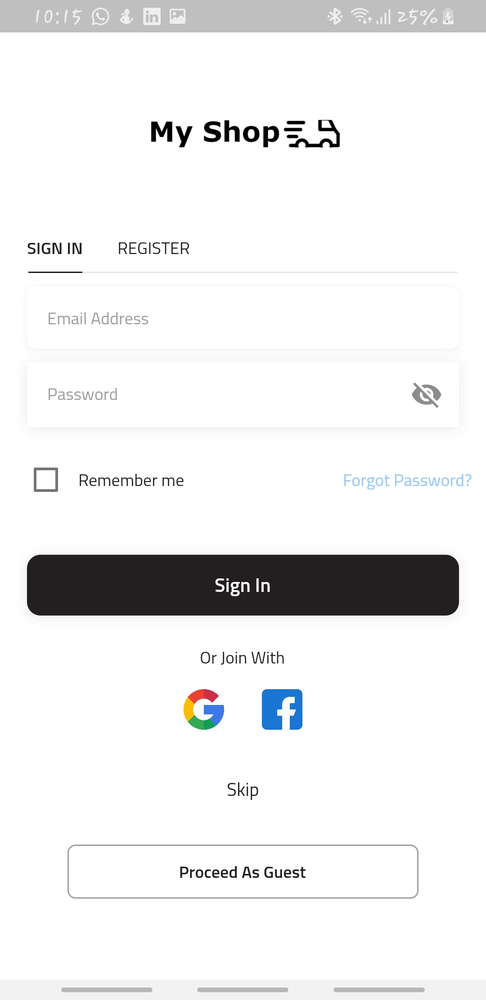
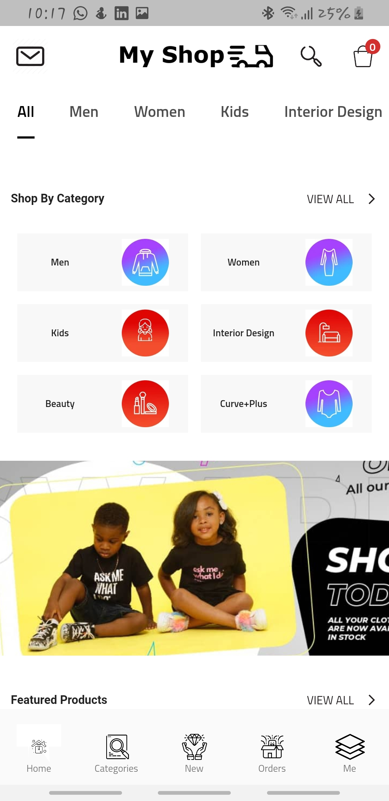
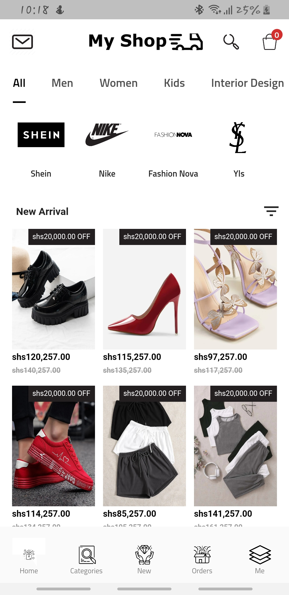
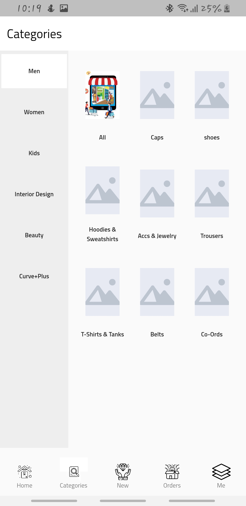

# My Shop

This is an online shopping platform.

## App Screenshots

![App LogIn] ![Main Page] ![Home Page] ![Categories page] ![Categories layout]

### Getting Started

Download Project

Install required dependacies and run App

For help getting started with Flutter, view our
[online documentation](https://flutter.dev/docs), which offers tutorials,
samples, guidance on mobile development, and a full API reference.
